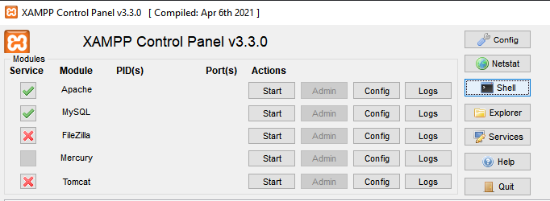
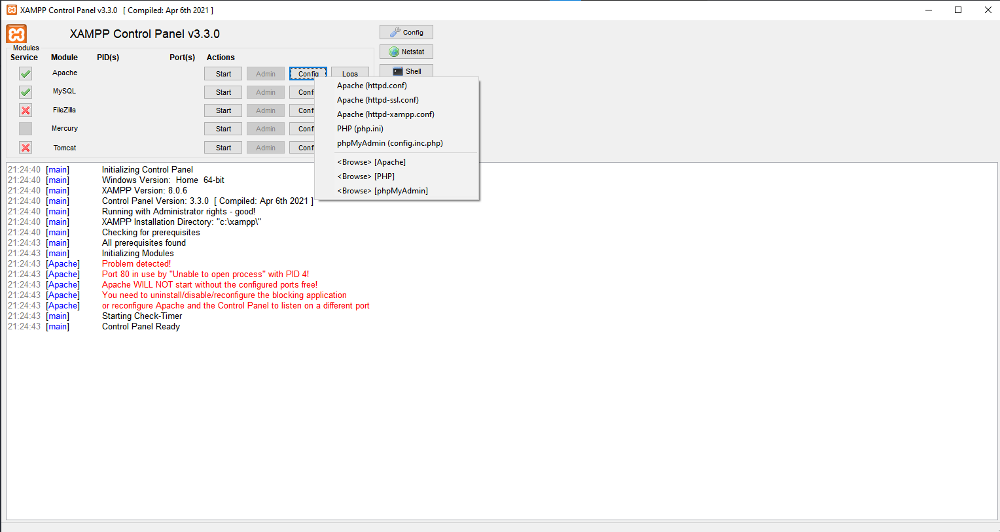
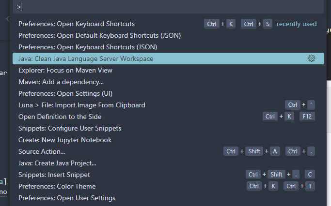

## DAOFactory
Clase Factory que devuelve la instancia de Factory db que se le solicite

## DAOS
Se tiene una interfaz DAO para cada entidad de db.
Cada interfaz DAO debe ser implementada por una clase que contenga el codigo para realizar las consultas a la db correspondiente ?? (no estoy segura pero creo que seria como en la clase MySQLFacturaDAO)

## DTOS
Se tienen clases DTOS con los atributos correspondientes a cada entidad.

## Revisar 
* El metodo del dao factory implementado (mysql) debe retornar la conexion ? 

## TODO
* Completar DAOS
  * Agregar a las interfaces los metodos que vamos a usar.
  * Implementar el codigo de los DAOS (las clases que se comunican con la DB ej: MySQLFacturaDAO). Falta crear el MySQLClienteDAO.
* Escribir el main.

* Hacer MySQLDAOFactory singleton

## Generar plantuml

`java -jar java2plantuml.jar tpe/src/main/java/com/tpe`

## Cambiar contraseña en MySQL xampp

 Se debe cambiar la contrseña del usuario root en la base de datos.

##### Cambiar contraseña de MySQL desde xampp
 - Abrir la shell desde XAMPP
`mysqladmin -u root password`
  La shell solicita una contraseña nueva

 

##### Cambiar contraseña de acceso de phpMyAdmin
 Para poder conectarse a la DB desde phpMyAdmin se debe configurar la nueva contraseña en **config.inc.php**

 `$cfg['Servers'][$i]['password'] = '**password-deseada**';`

## Configurar VSCode as IDE para Java y Maven
1. Descargar [ejecutable de maven](https://maven.apache.org/download.cgi)
2. Agregar la carpeta bin a las [variables de entorno del sistema](https://www.google.com/search?q=como+agregar+variables+de+entorno+en+windows&client=firefox-b-d&sca_esv=565424292&sxsrf=AM9HkKnrbZHzMBZhWkS_3x82b72a4Ugmhw%3A1694738724426&ei=JKkDZYbIGZTb1sQPoMySkAw&ved=0ahUKEwiG6p_dsauBAxWUrZUCHSCmBMIQ4dUDCA8&uact=5&oq=como+agregar+variables+de+entorno+en+windows&gs_lp=Egxnd3Mtd2l6LXNlcnAiLGNvbW8gYWdyZWdhciB2YXJpYWJsZXMgZGUgZW50b3JubyBlbiB3aW5kb3dzMgcQIxiKBRgnMgUQABiABDIGEAAYFhgeMgYQABgWGB4yBhAAGBYYHjIGEAAYFhgeMgYQABgWGB5I4wdQpQNY-wVwAXgBkAEAmAGLAaAB-AGqAQMwLjK4AQPIAQD4AQHCAgoQABhHGNYEGLAD4gMEGAAgQYgGAZAGCA&sclient=gws-wiz-serp)
3. Instalar las extensiones:
3.1 Extension Pack for Java
3.2 Debugger for Java
3.3 Test Runner for Java
3.4 Project Manager for Java
3.5 Maven for Java
 (Suelen venir pre-instaladas)

4. Solución de problemas.
4.1 Suele haber problemas con el cache del workspace del editor. Para limpiarlo ejecutar desde la paleta de comando de Visual (`Cmd+Shift+P`): 
  ***Java: Clean Java Language Server Workspace***
  

## Contenedor de docker de MySQL 
1. El archivo **mysql.yml** configura un docker compose con un contenedor de mysql. Para correrlo (requisito [Docker](https://www.docker.com/products/docker-desktop/) instalado): 
`docker-compose -f mysql.yml up`