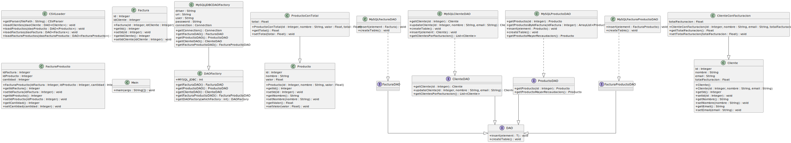

# TPE Integrador 1 - Arquitecturas WEB - TUDAI
### Descripción proyecto
El objetivo del presente trabajo es implementar una capa DAO para acceder a entidades de base datos.
En el proyecto implementamos la conexión a base de datos a través de JDBC, el patrón DAO para gestionar el acceso a datos y una capa de servicio sencilla que ejemplifica la utilización de algunos métodos de los DAOS.

### Diagramas 
##### Diagrama de Clases 

##### Diagrama de Entidad-Relación

## Setup
### Configuración de entorno de desarrollo
#### Configurar VSCode como IDE para Java y Maven
1. Descargar [ejecutable de maven](https://maven.apache.org/download.cgi)
2. Agregar la carpeta bin a las [variables de entorno del sistema](https://www.google.com/search?q=como+agregar+variables+de+entorno+en+windows&client=firefox-b-d&sca_esv=565424292&sxsrf=AM9HkKnrbZHzMBZhWkS_3x82b72a4Ugmhw%3A1694738724426&ei=JKkDZYbIGZTb1sQPoMySkAw&ved=0ahUKEwiG6p_dsauBAxWUrZUCHSCmBMIQ4dUDCA8&uact=5&oq=como+agregar+variables+de+entorno+en+windows&gs_lp=Egxnd3Mtd2l6LXNlcnAiLGNvbW8gYWdyZWdhciB2YXJpYWJsZXMgZGUgZW50b3JubyBlbiB3aW5kb3dzMgcQIxiKBRgnMgUQABiABDIGEAAYFhgeMgYQABgWGB4yBhAAGBYYHjIGEAAYFhgeMgYQABgWGB5I4wdQpQNY-wVwAXgBkAEAmAGLAaAB-AGqAQMwLjK4AQPIAQD4AQHCAgoQABhHGNYEGLAD4gMEGAAgQYgGAZAGCA&sclient=gws-wiz-serp)
3. Instalar las extensiones:
3.1 Extension Pack for Java
3.2 Debugger for Java
3.3 Test Runner for Java
3.4 Project Manager for Java
3.5 Maven for Java
 (Suelen venir pre-instaladas)

4. Solución de problemas.
4.1 Suele haber problemas con el cache del workspace del editor. Para limpiarlo ejecutar desde la paleta de comando de Visual (`Cmd+Shift+P`): 
  ***Java: Clean Java Language Server Workspace***
  
#### Cambiar contraseña en MySQL xampp

 Se debe cambiar la contrseña del usuario root en la base de datos.

##### Cambiar contraseña de MySQL desde xampp
 - Abrir la shell desde XAMPP
`mysqladmin -u root password`
  La shell solicita una contraseña nueva

 

##### Cambiar contraseña de acceso de phpMyAdmin
 Para poder conectarse a la DB desde phpMyAdmin se debe configurar la nueva contraseña en **config.inc.php**

 `$cfg['Servers'][$i]['password'] = '**password-deseada**';`

### Contenedor de docker de MySQL 
1. El archivo **mysql.yml** configura un docker compose con un contenedor de mysql. Para correrlo (requisito [Docker](https://www.docker.com/products/docker-desktop/) instalado): 
`docker-compose -f mysql.yml up`
-------------------------
## Generación automática de diagramas (PlantUML)
### Generar plantuml (Diagrama de clases UML) en VSCode
 - Instalar la extension PlantUML para VSCode 
 - Descargar el archivo `java2plantuml.jar` del [repositorio](https://github.com/mirajp1/java2plantuml/tree/master/src/main/java)
 - Ejecutar en consola `java -jar java2plantuml.jar path/al/codigo`

 - Si no hubo errores: 
    - Se crea un archivo de **output.puml**
 - Para visualizar: 
      - dentro de ese archivo click derecho y "**Preview Current Diagram**"

### Exportar archivo PlantUML como SVG en VSCode
* Click derecho dentro del archivo `.puml` generado 
* Seleccionar `Export Current Diagram`
  - Seleccionar el formato SVG
* Como resultado se crea una nueva carpeta con el archivo SVG
